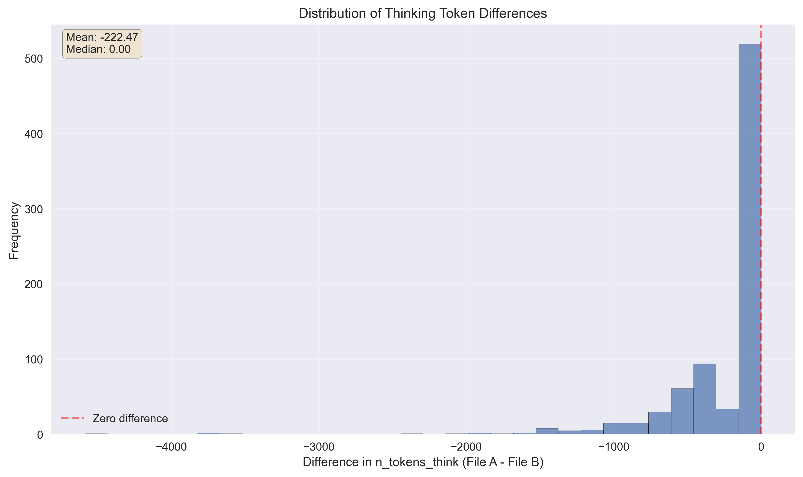
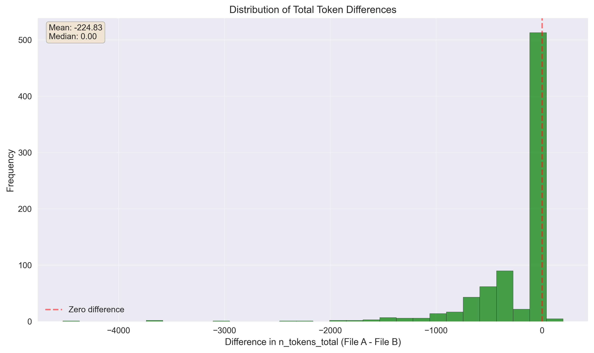

## Interence-time thinking budget adjustment study

This is a fork for the experiment. Check original [MMLU repo](https://github.com/TIGER-AI-Lab/MMLU-Pro) for more details about the benchmark itself.

## Experiment setup

This is an experimental fork to understand the inference-time tradeoff between thinking time and quality for LLM models with thinking like Qwen3.

Intuition: rather than disabling thinking with ```/nothink``` or somehow tuning model, we can manually adjust the logit value for ```</think>```.
This way, we'll nudge model to stop 'thinking' and produce the final, user-visible output, without hardcoding the limit/budget and still allow to think when it's really worth it.

Tweaking the value of this bias, we can achieve different tradeoffs between thinking time and quality.

Setup:
* Use [MMLU-Pro benchmark](https://github.com/TIGER-AI-Lab/MMLU-Pro). As of Jun 6, only psychology section is complete 
* Use [llama.cpp server](https://github.com/ggml-org/llama.cpp/tree/master/tools/server) for inference. It is easy to provide bias for a token.
* Use [Qwen3-30B_A3B model, Unsloth's Q6 quant](https://huggingface.co/unsloth/Qwen3-30B-A3B-GGUF)
* HW: Apple M2 Ultra
* Start with bias = 0, and extreme value of bias = 20 to confirm it works. Do a more thorough parameter search at the area where we observe the changes
* temp = 0

Limitations:
* Haven't run with '/nothink' yet to compare;
* Only one section completed, it takes a while, CS will be next to run;
* Bias is static. There's no dynamic schedule for bias adjustment;
* Bias is applied for every token, even after one `</think>` was already inserted;
* The dataset/benchmark/model combination is not particularly sensitive to the thinking amount;


## Results

Focusing on logit_bias=18 and comparing it to logit_bias=0, we can check the distribution of output length.

As we are applying the bias and not hardcoding the length, we are not 'uniformly thinking less'. In > 50% of cases model thinking time stays the same, and in other cases it is reduced a lot, as we can see in the distribution of think time (each data point is a sample in MMLU pro psychology dataset)



There is a small number of cases when total output length increased a bit. This makes sense, as model likely produces longer output for no-thinking cases.




## Instructions to reproduce

Get and build llama.cpp server from https://github.com/ggml-org/llama.cpp/tree/master/tools/server
Get the model, for example https://huggingface.co/unsloth/Qwen3-30B-A3B-GGUF

Start the server: 

Start the MMLU script: `eval_qwen3.sh </think_token_bias>`. This script has hardcoded token id for Qwen3 models, to use it with a different model change this script.

Once done, the data will be written to `eval_results/model_name_</think_token_bias>/<category>_result.json`.

We can get aggregated csv file with metrics:

```
$ python analyze_eval_results.py

```

Now we can run a script to compute number of tokens for thinking section and overall. The same llama.cpp server is used for tokenization `python analyze_token_metrics.py eval_results/Qwen3-30B-A3B-UD-Q6_K_XL_think_bias_20/psychology_result.json` will produce `eval_results/Qwen3-30B-A3B-UD-Q6_K_XL_think_bias_20/psychology_result_metrics.csv`
8. We can then run compare_token_metrics.py script to produce the distribution 

## Notes

qwen 3 </think> token:
```
(base) studio ~ % curl http://127.0.0.1:8080/tokenize -H "Content-Type: application/json" -d '{"content": "</think>"}'
{"tokens":[151668]}%
(base) studio ~ % curl http://127.0.0.1:8080/detokenize -H "Content-Type: application/json" -d '{"tokens": [151668]}'
{"content":"</think>"}%
```

